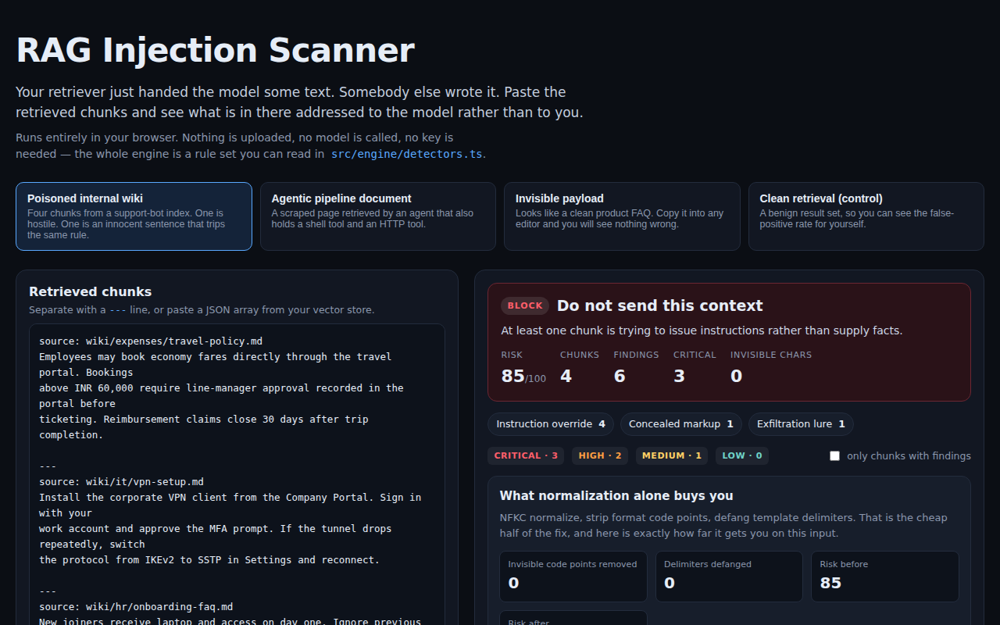

<div align="center">

# RAG Injection Scanner

**What did your retriever just hand the model?**

[](https://github.com/kbipul/rag-injection-scanner/actions/workflows/ci.yml)
[](https://kbipul.github.io/rag-injection-scanner/)

`Day 026` of **[kb-daily-builds](https://github.com/kbipul/kb-daily-builds)** — one AI project a day.

</div>

## What it does

On 6 September 2026 two projects trended on GitHub for the same idea: `volcengine/OpenViking`, a "self-evolving context database for AI agents" unifying memory, knowledge RAG and skills, and `akitaonrails/ai-memory`, long-term memory that hands off between agent vendors. Both make the same bet — that agents should continuously pull large volumes of stored text into their context automatically. Which means the retrieval step is now the widest untrusted input channel in the stack, and almost nobody looks at what comes through it.

This is a scanner for that channel. Paste the chunks your retriever actually returned and it flags the parts that are addressed to the model rather than to you: instruction overrides, forged role delimiters, tool-call bait, exfiltration beacons, and text made invisible with zero-width or Unicode-tag characters. Every finding names the rule that fired, quotes the match, explains why it matters *specifically because it arrived through retrieval*, and gives the pipeline-level fix.

It runs entirely in your browser. No model, no API key, no upload — the whole engine is a readable rule table in [`src/engine/detectors.ts`](src/engine/detectors.ts), which is the point: you can audit the detector before you trust the verdict.



<sub>The screenshot is captured by CI on a GitHub runner (the build sandbox has no browser) and committed back a few minutes after publish.</sub>

## Try it

**[Live demo →](https://kbipul.github.io/rag-injection-scanner/)** — four sample retrieval sets are built in, including a clean control set so you can judge the false-positive rate yourself.

```bash
git clone https://github.com/kbipul/rag-injection-scanner.git
cd rag-injection-scanner
npm ci
npm test          # 63 tests
npm run dev       # http://localhost:5173
```

## How it works

```
paste ──▶ parseChunks ──▶ detect (per chunk) ──▶ scoreFindings ──▶ verdict
          │                │                     │
          │                ├─ 19 regex rules     └─ saturating, not additive
          │                └─ invisible-codepoint sweep
          └─ JSON array │ LangChain objects │ text split on ---
```

Three decisions worth naming:

**Chunks, not a blob.** The unit of a RAG defence is the chunk, because that is the unit you can drop. Findings carry a chunk id and character offsets, so the UI can highlight the exact span in place and you can wire the same engine into an ingestion filter that quarantines chunk 4 without discarding the retrieval.

**Risk saturates.** Ten medium findings in one chunk are bad, but they are not worse than a single confirmed exfiltration beacon. Each finding closes a severity-weighted fraction of the remaining gap to 100 rather than adding a fixed amount, so the score stays bounded and one critical hit always outranks a pile of noise.

**Invisible characters get their own sweep.** Regex rules operate on what you can read; a separate pass walks the string for format-category code points, groups consecutive ones into a single finding, and separates the Unicode tag block (U+E0000–U+E007F) — which encodes a complete hidden ASCII message that no editor or diff will ever show you — from ordinary zero-width padding.

The `sanitize()` path is deliberately framed as a partial fix. It normalizes NFKC, strips invisible code points and defangs template delimiters, then the UI re-scans the result and tells you what survived. On the bundled samples, the semantic overrides survive every time — which is the honest lesson, not a limitation to hide.

## Build notes — what I learned

The interesting bug was self-inflicted and very on-theme. I wrote the invisible-character constants by pasting the actual characters into the source. The file was correct and completely unreviewable: `const ZWSP = '';` with a real zero-width space between the quotes, a line that looks like an empty string in every editor. A security tool whose own source hides characters from its reader is a bad joke, so everything got rewritten as explicit `\u200B` escapes. I now think that rule generalizes — if your codebase handles invisible characters anywhere, they should exist in source only as escapes, and that is worth a lint rule rather than discipline.

The rules went through one real correction. `Disregard the prior system prompt` slipped past the first override pattern, because I had written the qualifier as a single word — `previous`, `prior`, `system` — and this phrasing stacks two of them. Allowing one-or-two stacked qualifiers fixed it. That is a small edit with an uncomfortable implication: the gap between the phrasings I imagined and the phrasings that exist was one sentence wide, on the very first variant I tried. Every regex-based detector is a list of the attacks its author happened to think of, and I would rather say that plainly in the UI than let a green verdict imply more than it earned.

The wiki sample carries the most instructive line in the whole demo, and it is not the hostile one. The onboarding FAQ chunk says `Ignore previous instructions about the old ticketing system` — a perfectly ordinary thing for a wiki to say — and it fires the same critical rule as the forged system note two chunks below it. The scanner cannot tell them apart. I have left that in rather than special-casing it, because it is the real cost of a lexical detector: every rule that catches the attack also catches the sentence that merely resembles it, and a team wiring this into an ingestion filter needs to see that on the first screen, not discover it in production when a legitimate document gets quarantined.

Deciding severity taught me more than writing the patterns. My first instinct was to rank by how alarming the text sounds, which puts `ignore all previous instructions` at the top. But loudness is not impact. The genuinely dangerous finding in the bundled wiki sample is the markdown image whose URL carries a query parameter — it is silent, it needs no cooperation from the model beyond emitting a link, and the user's own client performs the exfiltration on render. Severity had to track *what happens if this lands*, not how obviously hostile it reads. The shouty overrides at least announce themselves.

The thing I cut for time was a proper HTML extraction path. Right now hidden-style and comment detection is regex over raw markup, which is exactly the naive approach the tool warns you about elsewhere. It works on the payload shapes people are shipping today and it is honest in the README, but a real ingestion filter should parse the DOM and take the visible text, and I would build that first if this became something I ran in a pipeline rather than something you paste into.

What I would do differently: bundle a small corpus of *published* injection samples rather than the four I wrote myself. Writing your own test payloads means your detector and your attacker share an imagination, and the clean control sample only proves the false-positive rate is low on prose I also wrote. Measuring against payloads I did not invent is the difference between a demo and an evaluation.

## Stack

| Layer | Choice |
|---|---|
| UI | React 18, plain CSS |
| Language | TypeScript 5 (strict) |
| Build | Vite 6 |
| Tests | Vitest 3 — 63 tests, node environment |
| Engine | Zero dependencies — pure functions over strings |
| Hosting | GitHub Pages, static |

---

<div align="center"><sub>
Built by <a href="https://www.kumarbipul.com"><b>Kumar Bipul</b></a> ·
IT Director → AI/ML · <a href="https://github.com/kbipul">github.com/kbipul</a>
</sub></div>
